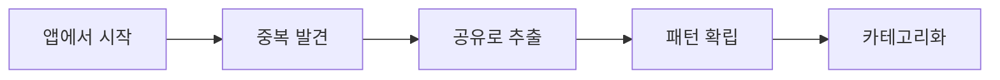
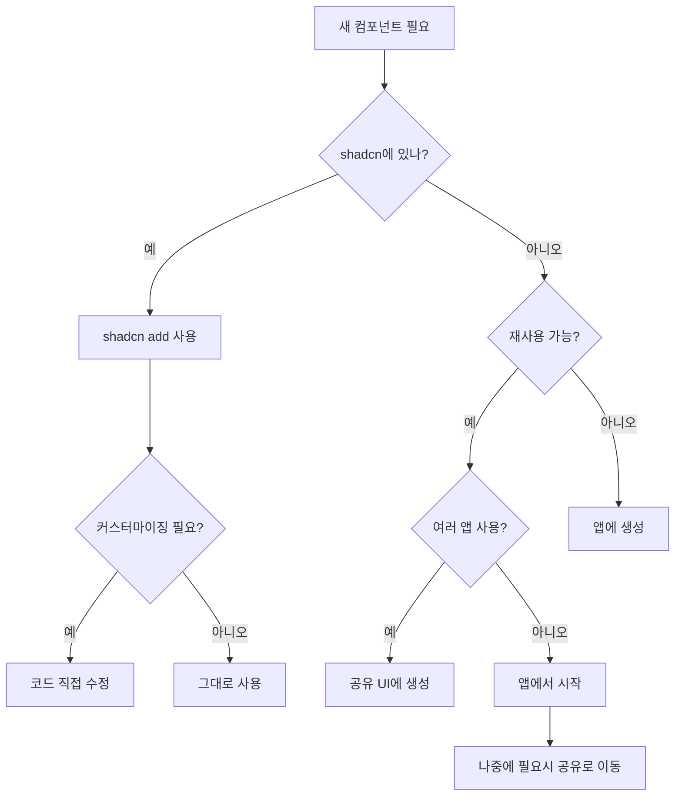

# shadcn/ui - from concepts to practices

## 목차

1. [들어가며: shadcn/ui의 정체성](#1-들어가며-shadcnui의-정체성)
2. [핵심 개념: 작동 원리](#2-핵심-개념-작동-원리)
3. [프로젝트 구조: 단일 앱에서 모노레포까지](#3-프로젝트-구조-단일-앱에서-모노레포까지)
4. [컴포넌트 체계: 개념과 현실](#4-컴포넌트-체계-개념과-현실)
5. [shadcn 코드 패턴: 7가지 핵심 원칙](#5-shadcn-코드-패턴-7가지-핵심-원칙)
6. [실전 가이드: 커스텀 컴포넌트 작성](#6-실전-가이드-커스텀-컴포넌트-작성)
7. [진화하는 구조: 프로젝트 성장 전략](#7-진화하는-구조-프로젝트-성장-전략)
8. [핵심 인사이트와 Best Practices](#8-핵심-인사이트와-best-practices)

---

## 1. 들어가며: shadcn/ui의 정체성

### 1.1 shadcn/ui는 무엇이 **아닌가**?

shadcn/ui를 이해하기 위해서는 먼저 그것이 **무엇이 아닌지**를 명확히 해야 합니다.

❌ **전통적인 npm 컴포넌트 라이브러리가 아닙니다**

- Material-UI, Ant Design, Chakra UI처럼 `npm install`로 설치하는 패키지가 아님
- node_modules에 의존성으로 존재하지 않음
- 버전 관리나 업데이트를 npm을 통해 하지 않음

### 1.2 그렇다면 shadcn/ui는 무엇인가

✅ **코드 배포 플랫폼 + 디자인 시스템 템플릿**

```
"This is not a component library. It is how you build your component library."
```

이 한 문장이 shadcn/ui의 본질을 담고 있습니다.

**핵심 철학:**

- **Open Code**: 컴포넌트의 실제 소스 코드를 당신의 프로젝트에 복사
- **Composition**: 모든 컴포넌트가 일관된 인터페이스로 예측 가능한 조합
- **Distribution**: CLI를 통한 효율적인 코드 배포 시스템

### 1.3 요리책 비유로 이해하기

전통적 라이브러리가 "완성된 요리를 배달"한다면, shadcn/ui는 "레시피와 재료를 제공"합니다.

- 🍕 **일반 라이브러리**: 피자 주문 (수정 불가, 토핑 변경 제한적)
- 👨‍🍳 **shadcn/ui**: 피자 레시피 제공 (재료부터 조리법까지 모두 커스터마이징 가능)

---

## 2. 핵심 개념: 작동 원리

### 2.1 npm 패키지의 실제 정체

```bash
npm install -g shadcn-ui  # 또는 npx shadcn@latest
```

**중요**: 이것은 컴포넌트가 아닌 **CLI 도구**를 설치하는 것입니다!

### 2.2 두 가지 핵심 명령어

#### `shadcn init` - 프로젝트 초기 설정

프로젝트를 shadcn/ui와 호환되도록 "수술"하는 과정:

1. **`components.json` 생성**

   ```json
   {
     "$schema": "https://ui.shadcn.com/schema.json",
     "style": "new-york",
     "tailwind": {
       "css": "app/globals.css",
       "baseColor": "neutral",
       "cssVariables": true
     },
     "aliases": {
       "components": "@/components",
       "ui": "@/components/ui"
     }
   }
   ```

2. **`tailwind.config.js` 수정**
   - 색상 시스템 추가 (hsl 변수 기반)
   - 애니메이션 플러그인 추가
   - 다크모드 설정

3. **`globals.css` 대폭 수정**

   ```css
   @layer base {
     :root {
       --background: 0 0% 100%;
       --foreground: 222.2 47.4% 11.2%;
       /* ... 약 20개의 색상 변수 */
     }
   }
   ```

4. **필수 dependencies 설치**
   - `clsx` - 조건부 클래스 결합
   - `tailwind-merge` - Tailwind 클래스 충돌 해결
   - `class-variance-authority` - 변형 관리
   - `lucide-react` - 아이콘

5. **`lib/utils.ts` 생성**

   ```typescript
   import { clsx, type ClassValue } from 'clsx';
   import { twMerge } from 'tailwind-merge';

   export function cn(...inputs: ClassValue[]) {
     return twMerge(clsx(inputs));
   }
   ```

#### `shadcn add [component]` - 컴포넌트 추가

```bash
npx shadcn add button
# 결과: components/ui/button.tsx 파일이 프로젝트에 생성됨
```

### 2.3 일반 라이브러리와의 근본적 차이

```javascript
// 🔴 일반 라이브러리 (예: Material-UI)
import { Button } from '@mui/material'; // node_modules에서 import

// 🟢 shadcn/ui
import { Button } from '@/components/ui/button'; // 내 프로젝트 파일에서 import
```

**차이점의 의미:**

- 수정 가능: 직접 코드를 수정할 수 있음
- 디버깅 용이: 소스 코드가 바로 보임
- 번들 크기 최적화: 사용하지 않는 코드 자동 제거
- 의존성 없음: 라이브러리 업데이트로 인한 breaking change 없음

---

## 3. 프로젝트 구조: 단일 앱에서 모노레포까지

### 3.1 단일 프로젝트 구조

기본적인 Next.js나 React 앱에서의 구조:

```
my-app/
├── app/                      # Next.js App Router
├── components/
│   ├── ui/                   # shadcn 컴포넌트들
│   │   ├── button.tsx
│   │   ├── card.tsx
│   │   └── dialog.tsx
│   └── custom/               # 내가 만든 컴포넌트
│       └── header.tsx
├── lib/
│   └── utils.ts              # cn 유틸리티 함수
├── styles/
│   └── globals.css           # 테마 CSS 변수
└── components.json           # shadcn 설정 파일
```

### 3.2 모노레포 구조

#### 모노레포 생성 방법

```bash
npx shadcn@latest init

# 프롬프트에서 선택:
? Would you like to start a new project?
  Next.js
❯ Next.js (Monorepo)  # 이것을 선택!
```

#### 자동 생성되는 구조

```
my-monorepo/
├── apps/
│   └── web/                          # 실제 애플리케이션
│       ├── app/
│       │   └── page.tsx
│       ├── components/               # 앱 전용 컴포넌트
│       │   └── login-form.tsx       # Block 컴포넌트
│       ├── components.json          # 앱용 설정
│       └── package.json
│
├── packages/
│   └── ui/                          # 공유 UI 라이브러리
│       ├── src/
│       │   ├── components/          # 재사용 가능한 UI 컴포넌트
│       │   │   ├── button.tsx
│       │   │   └── card.tsx
│       │   ├── hooks/
│       │   ├── lib/
│       │   │   └── utils.ts
│       │   └── styles/
│       │       └── globals.css
│       ├── components.json          # UI 라이브러리용 설정
│       └── package.json
│
├── turbo.json                       # Turborepo 설정
└── package.json
```

### 3.3 모노레포에서 컴포넌트 추가하기

**중요: 반드시 앱 디렉토리에서 실행해야 합니다!**

```bash
# ❌ 잘못된 방법
cd my-monorepo
npx shadcn add button  # 에러 발생!

# ✅ 올바른 방법
cd apps/web
npx shadcn add button  # 성공!
```

CLI가 자동으로 컴포넌트 타입을 파악하여:

- **기본 UI 컴포넌트** → `packages/ui/src/components/`
- **Block 컴포넌트** → `apps/web/components/`

### 3.4 모노레포 import 방식

```typescript
// apps/web에서 공유 UI 사용
import { Button } from '@workspace/ui/components/button';
import { cn } from '@workspace/ui/lib/utils';
import { useTheme } from '@workspace/ui/hooks/use-theme';
```

---

## 4. 컴포넌트 체계: 개념과 현실

### 4.1 개념적 3단계 분류

shadcn 컴포넌트는 개념적으로 3가지로 분류됩니다:

#### 1️⃣ Primitives (원시 컴포넌트)

- **정의**: 단일 책임을 가진 가장 작은 UI 단위
- **특징**:
  - 비즈니스 로직 없음
  - 완전히 재사용 가능
  - props로만 제어
- **예시**: Button, Input, Card, Badge

#### 2️⃣ Composites (복합 컴포넌트)

- **정의**: 여러 primitive를 조합한 컴포넌트
- **특징**:
  - 2개 이상의 primitive 조합
  - 특정 UI 패턴 구현
  - 여전히 범용적
- **예시**: Dialog, Form, DataTable, Accordion

#### 3️⃣ Blocks (블록 컴포넌트)

- **정의**: 완전한 기능을 가진 섹션/페이지 단위
- **특징**:
  - 비즈니스 로직 포함
  - 앱 특화 기능
  - API 호출, 라우팅 등
- **예시**: LoginForm, Dashboard, UserProfile

### 4.2 현실: 폴더 구조는 평평하다

**중요한 사실: shadcn은 컴포넌트 타입별로 폴더를 구분하지 않습니다!**

```
components/ui/
├── button.tsx        # Primitive인데도 여기
├── dialog.tsx        # Composite인데도 여기
├── accordion.tsx     # Composite인데도 여기
└── card.tsx          # Primitive인데도 여기
# 모두 같은 폴더에!
```

### 4.3 왜 구분하지 않는가?

1. **단순함**: 한 곳만 보면 됨
2. **주관성**: 분류는 사람마다 다름 (Accordion은 Primitive? Composite?)
3. **유연성**: 컴포넌트가 진화하면서 분류가 바뀔 수 있음
4. **CLI 호환성**: shadcn add 명령어가 단순해짐

### 4.4 실제 중요한 것

```typescript
// 이론적 분류보다 실용적 질문이 중요
const importantQuestions = {
  '재사용 가능한가?': boolean,
  '비즈니스 로직이 있는가?': boolean,
  '몇 개 앱에서 사용하는가?': number,
  'API를 호출하는가?': boolean,
};

// 위치 결정 기준
if (재사용가능 && 여러앱사용) {
  return 'packages/ui'; // 공유 라이브러리
} else {
  return 'apps/web/components'; // 앱 전용
}
```

---

## 5. shadcn 코드 패턴: 7가지 핵심 원칙

모든 shadcn 컴포넌트가 따르는 일관된 패턴이 있습니다.

### 5.1 forwardRef 패턴

#### React 18 버전

```typescript
const Button = React.forwardRef<
  HTMLButtonElement,
  ButtonProps
>(({ className, variant, size, ...props }, ref) => (
  <button
    ref={ref}
    className={cn(buttonVariants({ variant, size }), className)}
    {...props}
  />
))
Button.displayName = "Button"
```

#### React 19 버전 (최신)

```typescript
function Button({
  className,
  variant,
  size,
  ref,  // ref를 직접 prop으로 받음
  ...props
}: React.ComponentProps<"button"> & VariantProps<typeof buttonVariants>) {
  return (
    <button
      ref={ref}
      data-slot="button"  // Tailwind v4용
      className={cn(buttonVariants({ variant, size }), className)}
      {...props}
    />
  )
}
```

### 5.2 CVA (Class Variance Authority) 패턴

```typescript
import { cva, type VariantProps } from 'class-variance-authority';

const buttonVariants = cva(
  // 기본 클래스 (모든 변형에 공통)
  'inline-flex items-center justify-center rounded-md text-sm font-medium transition-colors',
  {
    variants: {
      variant: {
        default: 'bg-primary text-primary-foreground hover:bg-primary/90',
        destructive: 'bg-destructive text-destructive-foreground hover:bg-destructive/90',
        outline: 'border border-input bg-background hover:bg-accent',
        secondary: 'bg-secondary text-secondary-foreground hover:bg-secondary/80',
        ghost: 'hover:bg-accent hover:text-accent-foreground',
        link: 'text-primary underline-offset-4 hover:underline',
      },
      size: {
        default: 'h-10 px-4 py-2',
        sm: 'h-9 rounded-md px-3',
        lg: 'h-11 rounded-md px-8',
        icon: 'h-10 w-10',
      },
    },
    defaultVariants: {
      variant: 'default',
      size: 'default',
    },
  }
);
```

### 5.3 cn 유틸리티 함수

```typescript
// lib/utils.ts
import { clsx, type ClassValue } from "clsx"
import { twMerge } from "tailwind-merge"

export function cn(...inputs: ClassValue[]) {
  return twMerge(clsx(inputs))
}

// 사용 예시
className={cn(
  buttonVariants({ variant, size }),  // CVA 스타일
  "custom-class",                      // 추가 클래스
  className                            // props로 받은 클래스
)}
```

### 5.4 Radix UI Primitives 래핑

```typescript
import * as DialogPrimitive from "@radix-ui/react-dialog"

const Dialog = DialogPrimitive.Root
const DialogTrigger = DialogPrimitive.Trigger

const DialogContent = React.forwardRef<
  React.ElementRef<typeof DialogPrimitive.Content>,
  React.ComponentPropsWithoutRef<typeof DialogPrimitive.Content>
>(({ className, children, ...props }, ref) => (
  <DialogPrimitive.Portal>
    <DialogPrimitive.Overlay
      className={cn("fixed inset-0 z-50 bg-black/50", className)}
    />
    <DialogPrimitive.Content
      ref={ref}
      className={cn(
        "fixed left-[50%] top-[50%] z-50 translate-x-[-50%] translate-y-[-50%]",
        className
      )}
      {...props}
    >
      {children}
      <DialogPrimitive.Close className="absolute right-4 top-4">
        <X className="h-4 w-4" />
      </DialogPrimitive.Close>
    </DialogPrimitive.Content>
  </DialogPrimitive.Portal>
))
DialogContent.displayName = DialogPrimitive.Content.displayName
```

### 5.5 TypeScript 타입 패턴

```typescript
// Props 타입 정의
export interface ButtonProps
  extends React.ButtonHTMLAttributes<HTMLButtonElement>,
    VariantProps<typeof buttonVariants> {
  asChild?: boolean;
}

// Radix 컴포넌트 타입
type DialogContentProps = React.ComponentPropsWithoutRef<typeof DialogPrimitive.Content>;
```

### 5.6 asChild 패턴 (Slot)

```typescript
import { Slot } from "@radix-ui/react-slot"

const Button = forwardRef<HTMLButtonElement, ButtonProps>(
  ({ className, variant, size, asChild = false, ...props }, ref) => {
    const Comp = asChild ? Slot : "button"
    return (
      <Comp
        className={cn(buttonVariants({ variant, size }), className)}
        ref={ref}
        {...props}
      />
    )
  }
)

// 사용 예시
<Button asChild>
  <Link href="/home">Home</Link>  {/* Link가 Button 스타일을 받음 */}
</Button>
```

### 5.7 일관된 파일 구조

```typescript
"use client"  // Next.js 13+ 클라이언트 컴포넌트

import * as React from "react"
import { cva, type VariantProps } from "class-variance-authority"
import { cn } from "@/lib/utils"

// 1. variants 정의
const componentVariants = cva(...)

// 2. Props 인터페이스
export interface ComponentProps extends ... {}

// 3. 컴포넌트 정의
const Component = React.forwardRef<...>(...)

// 4. displayName 설정
Component.displayName = "Component"

// 5. export
export { Component, componentVariants }
```

---

## 6. 실전 가이드: 커스텀 컴포넌트 작성

### 6.1 shadcn 패턴을 따르는 커스텀 컴포넌트

```typescript
"use client"

import * as React from "react"
import { cva, type VariantProps } from "class-variance-authority"
import { AlertCircle, CheckCircle, XCircle } from "lucide-react"
import { cn } from "@/lib/utils"

// 1. Variants 정의
const alertVariants = cva(
  "relative w-full rounded-lg border p-4 [&>svg]:absolute [&>svg]:left-4 [&>svg]:top-4 [&>svg+div]:pl-7",
  {
    variants: {
      variant: {
        default: "bg-background text-foreground",
        success: "border-green-500/50 text-green-600 bg-green-50 dark:bg-green-950",
        destructive: "border-destructive/50 text-destructive bg-destructive/10",
        warning: "border-yellow-500/50 text-yellow-600 bg-yellow-50 dark:bg-yellow-950",
      },
    },
    defaultVariants: {
      variant: "default",
    },
  }
)

// 2. 아이콘 매핑
const iconMap = {
  default: AlertCircle,
  success: CheckCircle,
  destructive: XCircle,
  warning: AlertCircle,
}

// 3. Props 인터페이스
export interface AlertProps
  extends React.HTMLAttributes<HTMLDivElement>,
    VariantProps<typeof alertVariants> {
  title?: string
  description?: string
}

// 4. 컴포넌트 정의
const Alert = React.forwardRef<HTMLDivElement, AlertProps>(
  ({ className, variant, title, description, children, ...props }, ref) => {
    const Icon = iconMap[variant || "default"]

    return (
      <div
        ref={ref}
        role="alert"
        className={cn(alertVariants({ variant }), className)}
        {...props}
      >
        <Icon className="h-4 w-4" />
        <div>
          {title && <h5 className="mb-1 font-medium leading-none tracking-tight">{title}</h5>}
          {description && <div className="text-sm [&_p]:leading-relaxed">{description}</div>}
          {children}
        </div>
      </div>
    )
  }
)

// 5. displayName 설정
Alert.displayName = "Alert"

// 6. Export
export { Alert, alertVariants }
```

### 6.2 기존 shadcn 컴포넌트 확장

#### Primitive 확장 (여전히 Primitive)

```typescript
// IconButton - Button에 아이콘 추가
import { Button, ButtonProps } from "@/components/ui/button"
import { LucideIcon } from "lucide-react"

interface IconButtonProps extends ButtonProps {
  icon: LucideIcon
  iconPosition?: "left" | "right"
}

export function IconButton({
  icon: Icon,
  iconPosition = "left",
  children,
  ...props
}: IconButtonProps) {
  return (
    <Button {...props}>
      {iconPosition === "left" && <Icon className="mr-2 h-4 w-4" />}
      {children}
      {iconPosition === "right" && <Icon className="ml-2 h-4 w-4" />}
    </Button>
  )
}
```

#### Composite 생성 (여러 Primitive 조합)

```typescript
// SearchInput - Input + Button 조합
import { Input } from "@/components/ui/input"
import { Button } from "@/components/ui/button"
import { Search, X } from "lucide-react"
import { useState } from "react"

interface SearchInputProps {
  onSearch: (value: string) => void
  placeholder?: string
}

export function SearchInput({ onSearch, placeholder = "Search..." }: SearchInputProps) {
  const [value, setValue] = useState("")

  const handleSearch = () => {
    onSearch(value)
  }

  const handleClear = () => {
    setValue("")
    onSearch("")
  }

  return (
    <div className="relative flex items-center">
      <Search className="absolute left-3 h-4 w-4 text-muted-foreground" />
      <Input
        value={value}
        onChange={(e) => setValue(e.target.value)}
        onKeyDown={(e) => e.key === "Enter" && handleSearch()}
        placeholder={placeholder}
        className="pl-9 pr-20"
      />
      <div className="absolute right-1 flex gap-1">
        {value && (
          <Button
            size="sm"
            variant="ghost"
            onClick={handleClear}
            className="h-7 px-2"
          >
            <X className="h-3 w-3" />
          </Button>
        )}
        <Button
          size="sm"
          onClick={handleSearch}
          className="h-7 px-2"
        >
          Search
        </Button>
      </div>
    </div>
  )
}
```

#### Block 생성 (비즈니스 로직 포함)

```typescript
// LoginForm - 완전한 로그인 기능
import { useState } from "react"
import { useRouter } from "next/navigation"
import { Button } from "@/components/ui/button"
import { Input } from "@/components/ui/input"
import { Label } from "@/components/ui/label"
import { Card, CardContent, CardDescription, CardFooter, CardHeader, CardTitle } from "@/components/ui/card"
import { Alert } from "@/components/ui/alert"
import { useAuth } from "@/hooks/use-auth"  // 앱 특화 훅

export function LoginForm() {
  const [email, setEmail] = useState("")
  const [password, setPassword] = useState("")
  const [error, setError] = useState("")
  const [isLoading, setIsLoading] = useState(false)

  const { login } = useAuth()
  const router = useRouter()

  const handleSubmit = async (e: React.FormEvent) => {
    e.preventDefault()
    setError("")
    setIsLoading(true)

    try {
      await login(email, password)  // API 호출
      router.push("/dashboard")      // 라우팅
    } catch (err) {
      setError("Invalid email or password")
    } finally {
      setIsLoading(false)
    }
  }

  return (
    <Card className="w-full max-w-md">
      <CardHeader>
        <CardTitle>Login</CardTitle>
        <CardDescription>Enter your credentials to access your account</CardDescription>
      </CardHeader>
      <form onSubmit={handleSubmit}>
        <CardContent className="space-y-4">
          {error && (
            <Alert variant="destructive">
              {error}
            </Alert>
          )}
          <div className="space-y-2">
            <Label htmlFor="email">Email</Label>
            <Input
              id="email"
              type="email"
              value={email}
              onChange={(e) => setEmail(e.target.value)}
              required
            />
          </div>
          <div className="space-y-2">
            <Label htmlFor="password">Password</Label>
            <Input
              id="password"
              type="password"
              value={password}
              onChange={(e) => setPassword(e.target.value)}
              required
            />
          </div>
        </CardContent>
        <CardFooter>
          <Button
            type="submit"
            className="w-full"
            disabled={isLoading}
          >
            {isLoading ? "Logging in..." : "Login"}
          </Button>
        </CardFooter>
      </form>
    </Card>
  )
}
```

---

## 7. 진화하는 구조: 프로젝트 성장 전략

### 7.1 프로젝트 규모별 구조

#### 🌱 Small (컴포넌트 < 30개)

```
project/
└── components/
    └── ui/              # 모든 컴포넌트 한 곳에
        ├── button.tsx
        ├── card.tsx
        └── dialog.tsx
```

#### 🌿 Medium (컴포넌트 30-100개)

```
project/
└── components/
    └── ui/
        ├── core/        # 기본 컴포넌트
        │   ├── button.tsx
        │   └── input.tsx
        ├── forms/       # 폼 관련
        │   ├── form.tsx
        │   └── form-field.tsx
        └── data/        # 데이터 표시
            ├── table.tsx
            └── chart.tsx
```

#### 🌳 Large (컴포넌트 100개+)

```
packages/ui/src/
├── primitives/          # 기본 요소
│   ├── button/
│   └── input/
├── composites/          # 조합 컴포넌트
│   ├── dialog/
│   └── form/
├── patterns/            # 복잡한 패턴
│   ├── data-table/
│   └── dashboard/
└── themes/             # 테마 변형
    ├── default/
    └── dark/
```

### 7.2 점진적 마이그레이션 패턴



**실제 예시:**

```bash
# Stage 1: 앱에서 빠르게 프로토타입
apps/web/components/cool-chart.tsx

# Stage 2: 다른 앱도 필요
apps/admin/components/cool-chart.tsx  # 복사

# Stage 3: 중복 제거, 공유로 승격
packages/ui/src/components/cool-chart.tsx

# Stage 4: 패턴 정립
packages/ui/src/components/charts/cool-chart.tsx
```

### 7.3 커스텀 레지스트리 구축

대규모 팀에서는 자체 컴포넌트 레지스트리를 구축할 수 있습니다:

```json
// my-registry/registry.json
{
  "$schema": "https://ui.shadcn.com/schema/registry.json",
  "name": "my-company",
  "items": [
    {
      "name": "brand-header",
      "type": "registry:ui",
      "files": [
        {
          "path": "ui/brand-header.tsx",
          "type": "registry:component"
        }
      ],
      "dependencies": ["lucide-react"],
      "registryDependencies": ["button", "navigation-menu"]
    }
  ]
}
```

사용:

```bash
# 로컬 파일에서
npx shadcn add ./brand-header.json

# 원격 URL에서
npx shadcn add https://registry.mycompany.com/brand-header.json
```

---

## 8. 핵심 인사이트와 Best Practices

### 8.1 기억해야 할 핵심 원칙

#### 1. 코드 소유권 (Code Ownership)

- 라이브러리에 의존하지 않고 직접 코드 관리
- 수정과 확장이 자유로움
- 디버깅이 쉬움

#### 2. 점진적 복잡도 (Progressive Complexity)

- 단순하게 시작
- 필요할 때만 복잡도 추가
- 과도한 추상화 피하기

#### 3. 실용주의 (Pragmatism)

- 이론적 완벽함보다 실제 작동
- "primitive인가 composite인가"보다 "어디에 두면 재사용하기 좋은가"
- 필요할 때 리팩토링

### 8.2 실전 체크리스트

#### 프로젝트 시작 시

- [ ] `npx shadcn init` 실행
- [ ] 스타일 선택 (new-york 권장)
- [ ] components.json 확인
- [ ] 기본 컴포넌트 추가 (button, card, input 등)

#### 컴포넌트 추가 시

- [ ] 필요한 컴포넌트 확인
- [ ] `npx shadcn add [component]` 실행
- [ ] import 경로 확인
- [ ] 필요시 커스터마이징

#### 커스텀 컴포넌트 작성 시

- [ ] shadcn 패턴 따르기 (forwardRef, CVA, cn)
- [ ] TypeScript 타입 완벽 정의
- [ ] 재사용성 고려
- [ ] 적절한 위치 선택

#### 모노레포 작업 시

- [ ] 앱 디렉토리에서 add 명령 실행
- [ ] @workspace 네임스페이스 사용
- [ ] components.json 동기화

### 8.3 흔한 실수와 해결책

| 실수                              | 해결책                            |
| --------------------------------- | --------------------------------- |
| 모노레포 루트에서 `add` 실행      | 앱 디렉토리로 이동 후 실행        |
| 컴포넌트 분류에 과도한 시간 소비  | 재사용성만 고려하여 위치 결정     |
| 처음부터 복잡한 폴더 구조         | 평평하게 시작, 필요시 정리        |
| 모든 것을 공유 UI로 만들기        | 앱에서 시작, 필요시 공유로 승격   |
| npm update로 shadcn 업데이트 시도 | shadcn은 npm 패키지가 아님을 기억 |

### 8.4 의사결정 플로우차트



### 8.5 shadcn의 미래

shadcn/ui는 계속 진화하고 있습니다:

- **React 19 지원**: forwardRef 없는 새로운 패턴
- **Tailwind v4 지원**: 새로운 다크모드, OKLCH 색상
- **크로스 프레임워크**: Vue, Svelte 버전 개발 중
- **AI 통합**: 컴포넌트 자동 생성 및 최적화

---

## 마무리: shadcn/ui의 본질

### 한 문장 요약

**"shadcn/ui는 컴포넌트 라이브러리가 아니라, 당신이 컴포넌트 라이브러리를 만드는 방법입니다."**

### 핵심 가치

1. **자유**: 코드를 완전히 제어
2. **단순함**: 복잡한 추상화 없음
3. **일관성**: 모든 컴포넌트가 같은 패턴
4. **실용성**: 이론보다 실제 작동

### 최종 조언

**시작하는 분들께:**

- 공식 문서의 예제를 그대로 따라하세요
- 처음엔 수정하지 말고 그대로 사용하세요
- 패턴에 익숙해진 후 커스터마이징하세요

**중급 개발자분들께:**

- CVA와 cn 패턴을 마스터하세요
- 커스텀 컴포넌트도 같은 패턴으로 작성하세요
- 너무 이른 추상화를 피하세요

**고급 개발자분들께:**

- 자체 레지스트리 구축을 고려하세요
- 팀의 디자인 시스템과 통합하세요
- 하지만 단순함을 잃지 마세요

### 기억하세요

> "The best code is the code you can understand and modify."

shadcn/ui는 도구일 뿐입니다. 진정한 힘은 당신이 그것을 어떻게 사용하고, 어떻게 발전시키느냐에
있습니다.

---

## 부록: 유용한 리소스

### 공식 자료

- [shadcn/ui 공식 문서](https://ui.shadcn.com)
- [GitHub 저장소](https://github.com/shadcn-ui/ui)
- [컴포넌트 레지스트리](https://ui.shadcn.com/docs/components)

### 커뮤니티 리소스

- [Awesome shadcn/ui](https://github.com/birobirobiro/awesome-shadcn-ui)
- [shadcn/ui Blocks](https://ui.shadcn.com/blocks)
- Discord 커뮤니티

### 관련 기술

- [Radix UI](https://radix-ui.com)
- [Tailwind CSS](https://tailwindcss.com)
- [Class Variance Authority](https://cva.style)
- [Turborepo](https://turbo.build)
